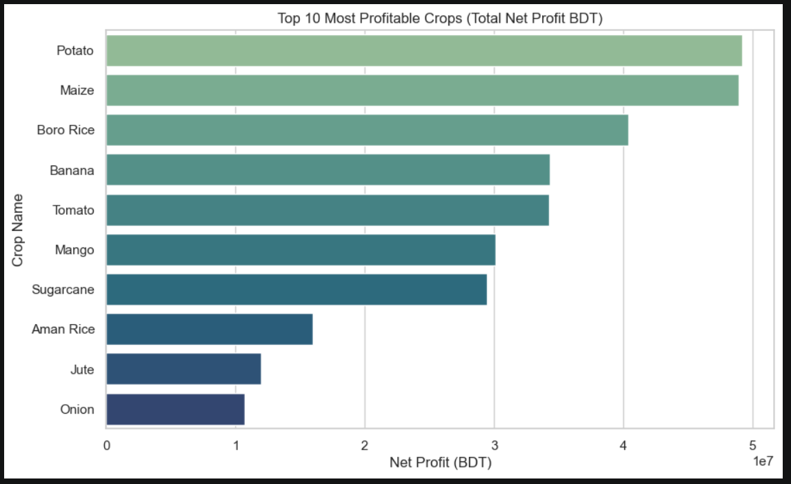
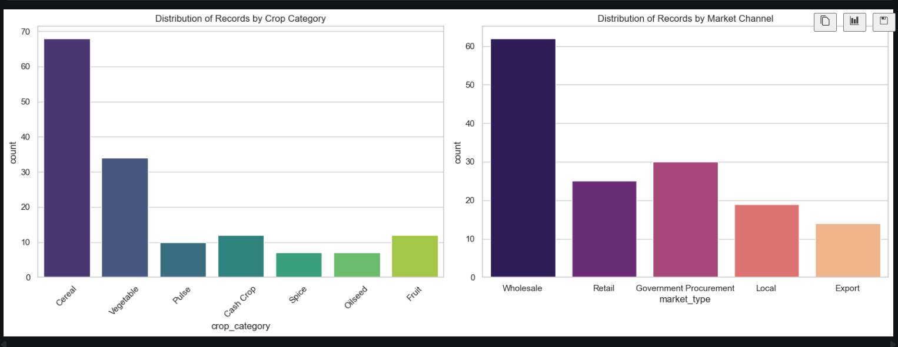
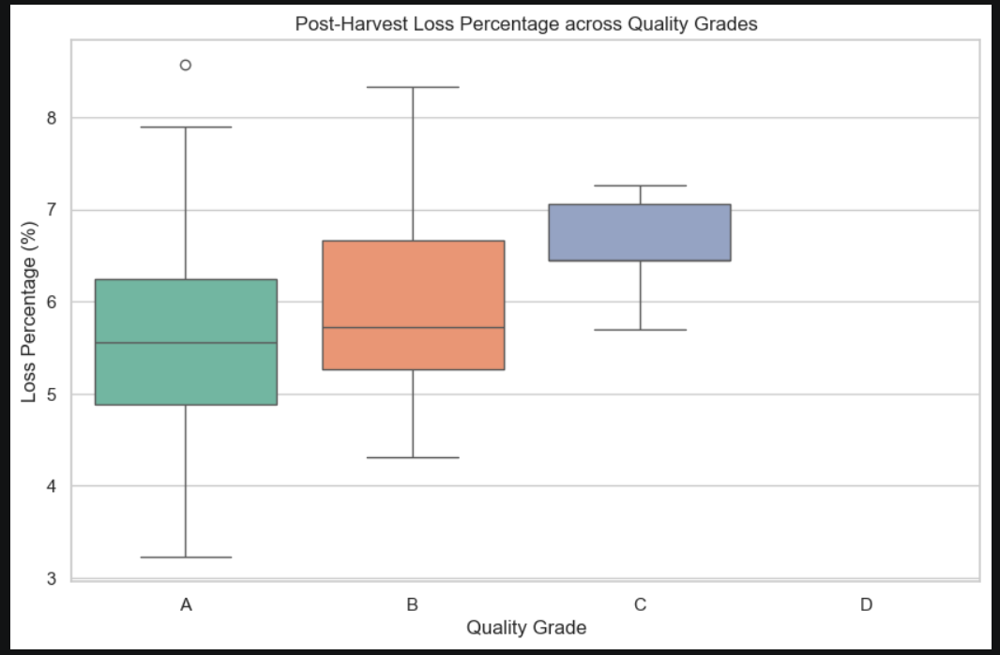

# Data Story & Analytics Blueprint

This document explains how the agriculture database was understood, cleaned conceptually, and transformed into analytics-ready API responses for the WeGro Agriculture Analytics API.

Instead of only listing database tables, this guide explains the data journey:

```text
Raw database records
-> analytical views
-> pandas DataFrames
-> service-level transformations
-> validated API responses
```

The goal is to show how the project thinks like a data product, not only like a backend API.

---

## 1. Data Product Mindset

The API was designed around one central question:

```text
How can raw agriculture records be converted into practical farm, crop, market, yield, loss, and quality insights?
```

The database already provides structured agriculture data. The backend transforms that data into decision-friendly summaries through FastAPI endpoints.

The project does not modify the database. It reads data, validates it, processes it using pandas, and returns clean JSON responses.

---

## 2. Source-of-Truth Strategy

The implementation treats the MySQL database as the only source of truth.

No endpoint uses hardcoded analytics values.

Every response is generated from:

```text
remote MySQL database
SQLAlchemy connection
pandas DataFrame processing
Pydantic response validation
```

This is important because PRD examples are static examples, while real API responses must reflect the actual database records.

---

## 3. Data Access Philosophy

The project does not allow random table reads from inside service functions.

Instead, data loading is controlled through:

```text
app/services/data_loader.py
```

This file acts as the controlled gateway between analytics logic and the database.

The intended flow is:

```text
analytics service
-> data_loader.py
-> database.py
-> SQLAlchemy engine
-> PyMySQL driver
-> remote MySQL
-> pandas DataFrame
```

This keeps database access consistent and prevents service files from becoming messy SQL-heavy modules.

---

## 4. Core Data Sources

The project mainly works with three analytical views and selected dimension tables.

### Analytical Views

```text
vw_harvest_full
vw_revenue_by_crop_year
vw_farm_profitability
```

### Dimension Tables

```text
dim_farm
dim_crop
dim_market
```

The views provide convenient reporting-level data.  
The dimension tables are used when endpoint requirements need extra metadata such as `farm_id`, `crop_id`, benchmark yield, growing season, market district, or price tier.

---

## 5. Main Working View: vw_harvest_full

Most API insights come from `vw_harvest_full`.

This view is useful because it combines farm, crop, season, market, harvest, revenue, cost, profit, quality, and loss-related fields into one analytics-friendly source.

Important fields used across the project include:

```text
farm_name
owner_name
region
farm_district
farm_type
crop_name
crop_category
growing_season
year
quarter
season
market_name
market_type
price_tier
area_planted_ha
quantity_harvested_ton
quantity_sold_ton
quantity_lost_ton
price_per_ton_bdt
revenue_bdt
input_cost_bdt
net_profit_bdt
quality_grade
pesticide_residue
```

This view powers most reporting logic because it already gives a near-complete business picture of each harvest and sale event.

---

## 6. Why Dimension Tables Were Still Needed

The views were useful, but they did not solve every endpoint requirement.

Some PRD requirements needed extra joins.

### dim_farm

Used because the single farm endpoint receives `farm_id`.

The harvest view contains farm names, but the endpoint path requires an integer farm ID.

So the service flow is:

```text
farm_id
-> validate in dim_farm
-> get farm_name and farm metadata
-> filter vw_harvest_full using farm_name
-> return farm performance
```

This keeps the path parameter meaningful and prevents invalid farm IDs.

---

### dim_crop

Used for crop-level metadata.

This table supports:

```text
crop_id filtering
crop growing season
benchmark yield
water requirement
crop category mapping
```

It is important for:

```text
/crops/yield-efficiency
/crops/quality-breakdown
/farms/loss-analysis
```

One important project decision was to join crop metadata when an endpoint needed `crop_id` or crop growing season. This avoided pretending that `vw_harvest_full` had columns it did not actually contain.

---

### dim_market

Used for market metadata.

This was important because market district should come from the market table, not from farm district.

For `/markets/price-comparison`, the correct interpretation is:

```text
market district = district of market channel
farm district = district of farm location
```

The endpoint therefore joins market metadata and uses `dim_market.district` for district filtering and output.

---

## 7. Endpoint-to-Data Lineage

This section shows how each endpoint gets its data.

### 1. Farm Summary

Endpoint:

```text
GET /farms/summary
```

Data source:

```text
vw_harvest_full
```

Main transformation:

```text
Group by farm_name, region, farm_type
Aggregate revenue, cost, profit, and average loss percentage
```

Business purpose:

```text
Give a quick health summary for farms.
```

---

### 2. Single Farm Performance

Endpoint:

```text
GET /farms/{farm_id}/performance
```

Data sources:

```text
dim_farm
vw_harvest_full
```

Main transformation:

```text
Validate farm_id
Map farm_id to farm_name
Filter harvest records for that farm
Return crop-year-market performance
```

Business purpose:

```text
Show detailed performance for one farm.
```

---

### 3. Top Farms Ranking

Endpoint:

```text
GET /farms/top
```

Data source:

```text
vw_farm_profitability
```

Main transformation:

```text
Filter optional dimensions
Rank farms by profit, revenue, or yield
Apply limit
```

Business purpose:

```text
Identify strongest farms by selected performance metric.
```

---

### 4. Loss Analysis

Endpoint:

```text
GET /farms/loss-analysis
```

Data sources:

```text
vw_harvest_full
dim_crop
```

Main transformation:

```text
Use crop growing season
Filter by region, year, quality grade, crop category
Calculate total harvested quantity
Calculate total lost quantity
Calculate overall loss percentage
Create grouped loss breakdown
```

Business purpose:

```text
Find where post-harvest losses are concentrated.
```

Important design note:

```text
For this endpoint, season means crop growing season:
Rabi, Kharif, Zaid, Year-Round
```

---

### 5. Crop Yield Efficiency

Endpoint:

```text
GET /crops/yield-efficiency
```

Data sources:

```text
vw_harvest_full
dim_crop
```

Main transformation:

```text
Calculate actual yield from harvest data
Compare it against benchmark yield from dim_crop
Calculate efficiency percentage
```

Formula:

```text
actual_avg_yield_ton_per_ha = quantity_harvested_ton / area_planted_ha
```

Benchmark:

```text
avg_yield_benchmark_ton_per_ha = dim_crop.avg_yield_ton_per_ha
```

Efficiency:

```text
efficiency_pct = actual_avg_yield_ton_per_ha / avg_yield_benchmark_ton_per_ha * 100
```

Business purpose:

```text
Understand whether crops are performing above or below benchmark yield.
```

Data observation:

```text
Some crops show exactly 100% efficiency because the sample database contains many benchmark-aligned harvest records.
This is a data characteristic, not a calculation error.
```

---

### 6. Seasonal Revenue Trend

Endpoint:

```text
GET /crops/seasonal-trend
```

Data source:

```text
vw_harvest_full
```

Main transformation:

```text
Group by crop_name, year, quarter, season
Sum quantity sold
Sum revenue
Calculate average selling price
Count harvest records
```

Business purpose:

```text
Understand how crop revenue changes over seasons and quarters.
```

Important usage note:

```text
crop_name expects values like Potato, Tomato, Boro Rice, Aman Rice.
crop_category expects values like Vegetable, Cereal, Fruit.
```

---

### 7. Market Price Comparison

Endpoint:

```text
GET /markets/price-comparison
```

Data sources:

```text
vw_harvest_full
dim_market
```

Main transformation:

```text
Join market metadata
Filter by market type, crop category, year, season, price tier, district
Group by market and crop
Calculate average price, total quantity sold, and revenue
```

Business purpose:

```text
Compare which markets and channels provide better crop prices.
```

Implementation correction:

```text
The district field is taken from dim_market, not farm district.
```

---

### 8. Quality Grade Breakdown

Endpoint:

```text
GET /crops/quality-breakdown
```

Data sources:

```text
vw_harvest_full
dim_crop
```

Main transformation:

```text
Join crop metadata for crop_id support
Filter by crop, region, year, market type, and residue level
Count records by quality grade
Calculate grade percentage
Calculate average revenue per grade
Count pesticide residue levels
```

Business purpose:

```text
Show how crop quality and pesticide residue are distributed.
```

Response design:

```text
All grades A, B, C, D are returned.
All residue levels None, Trace, Low, High are returned.
Zero-count categories are included for a complete response shape.
```

---

## 8. pandas Transformation Pattern

Most service functions follow a similar pandas pattern:

```text
1. Load required DataFrames.
2. Validate that required columns exist.
3. Apply optional filters.
4. Check if filtered data is empty.
5. Merge dimension metadata if required.
6. Group and aggregate.
7. Calculate derived metrics.
8. Round numeric values.
9. Convert DataFrame to JSON-safe records.
```

This pattern keeps the analytics consistent across endpoints.

---

## 9. Shared DataFrame Utilities

Reusable pandas operations are kept in:

```text
app/services/dataframe_utils.py
```

This file supports the service layer with functions such as:

```text
apply_optional_filters()
validate_required_columns()
ensure_dataframe_not_empty()
round_numeric_columns()
dataframe_to_records()
```

These utilities are intentionally stateless.

They do not know about API endpoints.  
They do not connect to the database.  
They only work with pandas DataFrames.

This keeps them reusable and easy to test.

---

## 10. Data Validation and No-Data Handling

The project handles two different problems separately.

### Invalid request values

Example:

```text
/farms/top?metric=random
```

This is a request validation issue.

Expected response:

```text
422 Unprocessable Entity
```

### Valid request values but no matching data

Example:

```text
/markets/price-comparison?district=UnknownDistrict
```

This is not a validation issue.  
The parameter is valid as a string, but the database has no matching row.

Expected response:

```text
404 Not Found
```

This distinction improves API correctness and user experience.

---

## 11. EDA Notebook Role

The repository includes:

```text
notebooks/01_comprehensive_eda.ipynb
```

The notebook is used for analysis, not production runtime.

Its purpose is to support:

```text
column understanding
distribution checks
farm and crop exploration
market pattern exploration
quality and residue analysis
visualization
business interpretation
```

The notebook helps demonstrate the data science process behind the API.

It is not required to start the server.


---

## Exploratory Visualization Highlights

The EDA notebook was used to understand the agriculture dataset before finalizing the API logic. These visualizations helped identify crop profitability patterns, category and market distribution, and the relationship between quality grade and post-harvest loss.

These charts are not part of the API runtime. They were used as supporting analysis to understand the data and design meaningful analytics endpoints.

---

### 1. Top 10 Most Profitable Crops



This chart ranks the top 10 crops by total net profit in BDT.

The visualization shows that **Potato**, **Maize**, and **Boro Rice** are the strongest profit-generating crops in the dataset. Potato and Maize appear very close at the top, both contributing nearly 50 million BDT in total net profit. Boro Rice also shows strong performance, followed by Banana, Tomato, Mango, and Sugarcane.

Crops such as **Onion**, **Jute**, and **Aman Rice** appear lower in the top-10 list, which suggests that profitability is not evenly distributed across crops. A small group of crops contributes a much larger share of total profit.

This insight supports the need for analytics endpoints such as:

```text
/farms/top
/crops/yield-efficiency
/crops/seasonal-trend
/markets/price-comparison
```

The chart also helps explain why profitability should be analyzed together with yield, market price, and seasonal trend. A crop may be profitable because of strong yield, better market price, lower cost, or larger production volume.

Key takeaway:

```text
Potato, Maize, and Boro Rice are the major profit contributors in the available dataset.
```

---

### 2. Crop Category and Market Channel Distribution



This visualization contains two distribution checks: one for crop categories and one for market channels.

The crop category chart shows that **Cereal** records dominate the dataset. **Vegetable** crops are the second most frequent category. Other categories such as Fruit, Cash Crop, Pulse, Spice, and Oilseed appear in smaller numbers.

This means that some API results may naturally contain more Cereal and Vegetable records than other categories. If a Cereal filter returns more data than a Spice or Oilseed filter, it reflects the underlying data distribution rather than an API issue.

The market channel chart shows that **Wholesale** is the most common market type in the dataset. Government Procurement and Retail also have noticeable representation, while Local and Export channels appear less frequently.

This distribution is important for interpreting endpoints such as:

```text
/crops/seasonal-trend
/markets/price-comparison
/crops/quality-breakdown
```

For example, market price analysis may show more stable or more frequent results for Wholesale because that channel has more records. Export may return fewer records because it has lower representation in the dataset.

Key takeaway:

```text
The dataset is heavily represented by Cereal crops and Wholesale market transactions.
```

---

### 3. Post-Harvest Loss Percentage across Quality Grades



This boxplot compares post-harvest loss percentage across quality grades.

Grade **A** shows a wider spread of loss percentages, including lower-loss records and some higher-loss outliers. Grade **B** also has a broad range, with some records reaching relatively high loss percentages. Grade **C** appears more concentrated in the visible chart and shows loss values mostly around the higher mid-range. Grade **D** does not show a visible distribution in this plot, which suggests that there may be no records or very limited records for that grade in the plotted data.

This chart shows that quality grade is not only a label for produce quality. It can also be useful for understanding post-harvest loss behavior. Higher-quality grades may still experience loss variation, and some grades may have more consistent or more concentrated loss patterns.

This insight supports the design of:

```text
/farms/loss-analysis
/crops/quality-breakdown
```

The loss analysis endpoint quantifies where losses are happening, while the quality breakdown endpoint connects quality grades with record counts, revenue, and pesticide residue distribution.

Key takeaway:

```text
Post-harvest loss varies across quality grades, and quality grade is useful for analyzing both production quality and loss behavior.
```

---

### Overall EDA Interpretation

The visualizations show that the dataset contains meaningful variation across crops, crop categories, market channels, and quality grades.

Main observations:

```text
Potato, Maize, and Boro Rice are leading profit contributors.
Cereal and Vegetable crops have the strongest representation in the dataset.
Wholesale is the most common market channel.
Post-harvest loss percentage varies across quality grades.
Some categories and market channels have fewer records, which affects filtered API outputs.
```

These observations helped shape the final API design. Instead of returning raw database rows, the project exposes focused analytics endpoints that allow filtering by farm, crop, region, year, season, market type, quality grade, and pesticide residue.

The EDA confirms that the API endpoints are meaningful because the underlying dataset contains enough variation to support farm performance analysis, crop yield comparison, seasonal trend analysis, market price comparison, loss analysis, and quality breakdown reporting.
---
## 12. Docker Data Boundary

The Docker image is focused only on the API runtime.

Included:

```text
app/
requirements.txt
Python runtime
installed dependencies
```

Excluded:

```text
.env
.git
local .venv
notebooks
cache files
local database files
```

Database credentials are passed at runtime:

```bash
docker run --rm --env-file .env -p 8000:8000 wegro-agriculture-api
```

This keeps the image cleaner and avoids leaking secrets.

---

## 13. Key Data Decisions

Several important decisions were made during implementation:

```text
Use PRD-recommended views where possible.
Use dimension tables only when endpoint logic requires them.
Calculate actual yield from harvest quantity and planted area.
Use dim_crop for benchmark yield.
Use dim_market for market district.
Use dim_farm for farm_id validation.
Keep pandas utilities separate from business services.
Return complete grade and residue keys even when counts are zero.
Avoid hardcoded analytics values.
```

---

## 14. Summary

The data layer is designed to be:

```text
read-only
database-driven
pandas-friendly
traceable
modular
safe
aligned with endpoint requirements
```

The API turns the provided agriculture database into a structured analytics service while keeping the data processing logic transparent and maintainable.