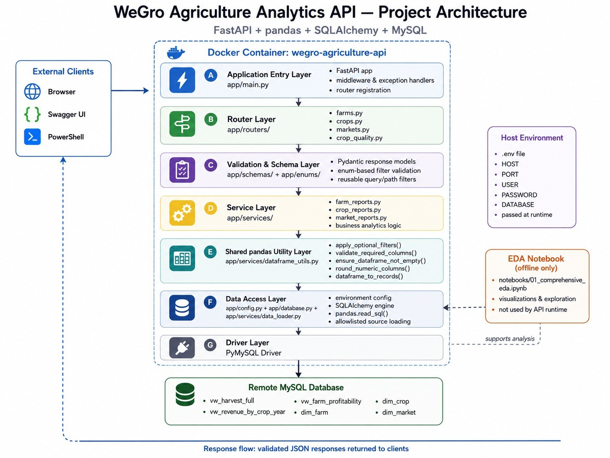

# WeGro Agriculture Analytics API - Architecture
---


## Table of Contents

- [WeGro Agriculture Analytics API - Architecture](#wegro-agriculture-analytics-api---architecture)
  - [Table of Contents](#table-of-contents)
  - [Architecture Overview](#architecture-overview)
  - [Architecture Diagram](#architecture-diagram)
  - [1. External Client Layer](#1-external-client-layer)
  - [2. Application Entry Layer](#2-application-entry-layer)
  - [3. Router Layer](#3-router-layer)
  - [4. Validation \& Schema Layer](#4-validation--schema-layer)
  - [5. Service Layer](#5-service-layer)
    - [farm\_reports.py](#farm_reportspy)
    - [crop\_reports.py](#crop_reportspy)
    - [market\_reports.py](#market_reportspy)
  - [6. Shared pandas Utility Layer](#6-shared-pandas-utility-layer)
  - [7. Data Access Layer](#7-data-access-layer)
  - [8. Remote MySQL Database Layer](#8-remote-mysql-database-layer)
  - [9. Request and Response Lifecycle](#9-request-and-response-lifecycle)
  - [10. Docker Runtime Architecture](#10-docker-runtime-architecture)
  - [11. Environment Configuration](#11-environment-configuration)
  - [12. Notebook and EDA Separation](#12-notebook-and-eda-separation)
  - [13. Error Handling Architecture](#13-error-handling-architecture)
  - [14. Design Principles](#14-design-principles)
  - [Architecture Summary](#architecture-summary)

---
This document explains the backend architecture of the **WeGro Agriculture Analytics API**, built for the WeGro Technologies Limited Associate Data Scientist Technical Assessment.

The system is designed as a clean, layered FastAPI application that connects to a remote MySQL agriculture database, processes data with pandas, and returns validated JSON responses through 8 analytics endpoints.

---

## Architecture Overview

The project follows a layered backend architecture:

```text
External Client
-> FastAPI Application Entry
-> Router Layer
-> Validation & Schema Layer
-> Service Layer
-> Shared pandas Utility Layer
-> Data Access Layer
-> SQLAlchemy + PyMySQL
-> Remote MySQL Database
-> JSON Response
```

This structure separates API routing, validation, analytics logic, utility functions, and database access into different modules.

---

## Architecture Diagram

The project architecture diagram is stored at:

```text
docs/assets/Project_Architecture.jpeg
```

Preview:



---

## 1. External Client Layer

The API can be accessed through:

```text
Browser
Swagger UI
PowerShell Invoke-RestMethod
```

During development and testing, the endpoints were mainly checked using:

```text
Swagger UI
PowerShell
Automated smoke test scripts
```

Example request:

```text
GET /farms/summary?region=Dhaka&year=2023
```

The client sends HTTP requests to the FastAPI server and receives JSON responses.

---

## 2. Application Entry Layer

Main file:

```text
app/main.py
```

Responsibilities:

```text
Create the FastAPI application
Register all routers
Configure API title and metadata
Expose Swagger/OpenAPI documentation
Register global exception handlers
Control request lifecycle at the application level
```

Swagger UI is available at:

```text
http://127.0.0.1:8000/docs
```

OpenAPI JSON is available at:

```text
http://127.0.0.1:8000/openapi.json
```

---

## 3. Router Layer

Folder:

```text
app/routers/
```

Router files:

```text
farms.py
crops.py
markets.py
crop_quality.py
```

Responsibilities:

```text
Define endpoint paths
Receive query and path parameters
Attach response models
Add Swagger descriptions
Call the correct service-layer function
Keep API route logic minimal
```

Implemented endpoints:

```text
GET /farms/summary
GET /farms/{farm_id}/performance
GET /farms/top
GET /farms/loss-analysis

GET /crops/yield-efficiency
GET /crops/seasonal-trend
GET /markets/price-comparison
GET /crops/quality-breakdown
```

The router layer does not perform heavy analytics.  
Its job is to receive validated inputs and delegate business logic to the service layer.

---

## 4. Validation & Schema Layer

Folders:

```text
app/schemas/
app/enums/
```

Important files:

```text
app/schemas/filters.py
app/schemas/farm_reports.py
app/schemas/crop_reports.py
app/schemas/market_reports.py
app/enums/filters.py
```

Responsibilities:

```text
Define Pydantic response models
Define accepted enum values
Define reusable query/path filters
Improve Swagger documentation
Validate request parameters
Serialize API responses cleanly
```

Examples of validated filters:

```text
region
farm_type
crop_category
season
market_type
price_tier
quality_grade
pesticide_residue
water_requirement
year
quarter
metric
limit
```

Invalid values are rejected automatically with HTTP `422`.

Example:

```text
/farms/summary?region=InvalidCity
```

Expected result:

```text
422 Unprocessable Entity
```

---

## 5. Service Layer

Folder:

```text
app/services/
```

Main files:

```text
farm_reports.py
crop_reports.py
market_reports.py
```

Responsibilities:

```text
Load required data
Apply business filters
Perform pandas transformations
Group and aggregate records
Calculate analytics metrics
Prepare response-ready dictionaries
Raise clean no-data errors
```

### farm_reports.py

Handles:

```text
/farms/summary
/farms/{farm_id}/performance
/farms/top
/farms/loss-analysis
```

Main analytics:

```text
Farm revenue summary
Single farm performance
Top farm ranking
Post-harvest loss analysis
```

### crop_reports.py

Handles:

```text
/crops/yield-efficiency
/crops/seasonal-trend
/crops/quality-breakdown
```

Main analytics:

```text
Yield efficiency comparison
Seasonal revenue trend
Quality grade distribution
Pesticide residue breakdown
```

### market_reports.py

Handles:

```text
/markets/price-comparison
```

Main analytics:

```text
Market-wise price comparison
Market type analysis
District and price tier comparison
```

---

## 6. Shared pandas Utility Layer

File:

```text
app/services/dataframe_utils.py
```

This file contains reusable stateless pandas helper functions.

Important functions:

```text
apply_optional_filters()
validate_required_columns()
ensure_dataframe_not_empty()
round_numeric_columns()
dataframe_to_records()
```

Purpose:

```text
Avoid duplicate pandas logic
Keep service files clean
Centralize common DataFrame operations
Improve readability and maintainability
```

This layer does not connect to the database.  
It only works with pandas DataFrames already loaded by the data access layer.

---

## 7. Data Access Layer

Files:

```text
app/config.py
app/database.py
app/services/data_loader.py
```

Responsibilities:

```text
Read database configuration from environment variables
Create SQLAlchemy engine
Manage MySQL connectivity
Load allowlisted database views and tables
Return pandas DataFrames to the service layer
```

Correct data access flow:

```text
Service Layer
-> data_loader.py
-> database.py
-> SQLAlchemy Engine
-> PyMySQL Driver
-> Remote MySQL Database
```

The data loader does not bypass SQLAlchemy.  
All database reads go through the SQLAlchemy engine and PyMySQL driver.

---

## 8. Remote MySQL Database Layer

Database:

```text
agriculture_db
```

The project uses the provided Star Schema-based agriculture database.

Main analytical views:

```text
vw_harvest_full
vw_revenue_by_crop_year
vw_farm_profitability
```

Dimension tables used:

```text
dim_farm
dim_crop
dim_market
```

Usage examples:

```text
dim_farm
```

Used for farm metadata and farm ID validation.

```text
dim_crop
```

Used for crop metadata, crop ID filtering, growing season, water requirement, and benchmark yield.

```text
dim_market
```

Used for market metadata, market district, and price tier.

```text
vw_harvest_full
```

Used as the primary harvest, sales, crop, farm, season, revenue, profit, quality, and loss data source.

---

## 9. Request and Response Lifecycle

Example request:

```text
GET /crops/yield-efficiency?crop_category=Vegetable&year=2023&region=Dhaka
```

Processing flow:

```text
1. User sends an HTTP request through Browser, Swagger UI, or PowerShell.

2. FastAPI receives the request through app/main.py.

3. Application-level middleware and exception handlers are available before routing.

4. Router layer maps the request to the correct endpoint function.

5. Schema and enum layers validate query/path parameters.

6. Service layer executes business analytics logic.

7. Data loader reads required data through SQLAlchemy + PyMySQL.

8. pandas performs filtering, grouping, aggregation, and calculation.

9. Shared utility functions clean and serialize DataFrame results.

10. Pydantic response model validates the final response shape.

11. Clean JSON response is returned to the client.
```

---

## 10. Docker Runtime Architecture

The project includes a multi-stage Dockerfile.

Docker runtime command:

```bash
docker run --rm --env-file .env -p 8000:8000 wegro-agriculture-api
```

Runtime flow:

```text
Host Machine
-> Docker Container
-> FastAPI + Uvicorn
-> Application Code
-> SQLAlchemy + PyMySQL
-> Remote MySQL Database
```

The Docker image contains:

```text
FastAPI application code
Installed Python dependencies
Python runtime environment
Internal virtual environment
```

The Docker image does not contain:

```text
.env
local .venv
.git
notebooks
database credentials
local cache files
```

---

## 11. Environment Configuration

Database credentials are stored in a local `.env` file.

Environment variable names used by this project:

```text
HOST
PORT
USER
PASSWORD
DATABASE
```

Example:

```env
HOST=your_mysql_host
PORT=3306
USER=your_mysql_username
PASSWORD=your_mysql_password
DATABASE=agriculture_db
```

Security rules:

```text
.env is not committed to GitHub
.env is not copied into Docker image
.env is passed at runtime with --env-file
credentials are not hardcoded in source code
```

---

## 12. Notebook and EDA Separation

Notebook file:

```text
notebooks/01_comprehensive_eda.ipynb
```

Purpose:

```text
Exploratory Data Analysis
Data understanding
Visualization
Business insight generation
```

Important note:

```text
The notebook is not part of API runtime.
The notebook is not required to start FastAPI.
The notebook is not copied into Docker image.
The notebook supports analysis and documentation only.
```

This keeps the production API clean while still showing data science investigation.

---

## 13. Error Handling Architecture

Custom error logic is handled through:

```text
app/exceptions.py
app/main.py
```

Error handling goals:

```text
Return 422 for invalid filters
Return 404 when valid filters produce no matching rows
Return clear error messages
Avoid raw stack traces in API responses
Improve recruiter and user experience
```

Example invalid filter:

```text
/farms/top?metric=random
```

Expected:

```text
422 Unprocessable Entity
```

Example valid filter but no data:

```text
/markets/price-comparison?district=UnknownDistrict
```

Expected:

```text
404 Not Found
```

---

## 14. Design Principles

The architecture follows these principles:

```text
Layered architecture
Separation of concerns
Reusable utilities
Enum-based validation
Pydantic response validation
pandas-based analytics
No hardcoded credentials
Dockerized deployment
Clean error handling
Notebook separated from API runtime
```

---

## Architecture Summary

```text
User Action
-> External Client
-> FastAPI Application
-> Router
-> Validation & Schema
-> Service Logic
-> Shared pandas Utilities
-> Data Loader
-> SQLAlchemy Engine
-> PyMySQL Driver
-> Remote MySQL Database
-> JSON Response
```

This structure makes the project clean, testable, maintainable, and suitable for recruiter review.